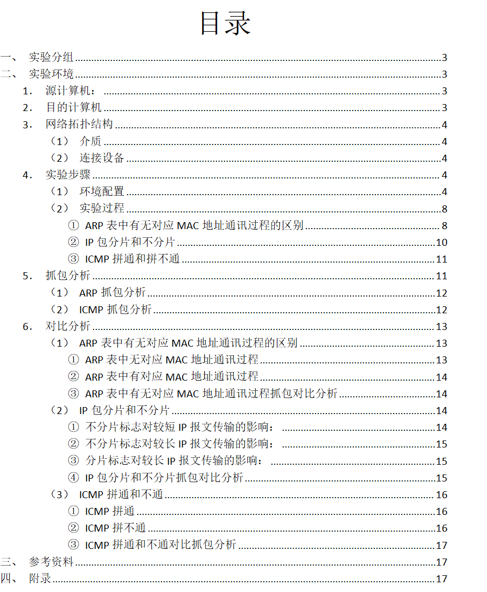

# 使用说明

**Wireshark 抓包分析`IP`、`ARP`、`ICMP`协议**

点击对应的bat脚本，按照提示一步一步完成即可

注意&必要：

```bat
::本Bat脚本可作为模板：添加步骤则直接复制一整段，修改命令，请在Start和End中间的区域修改，若未修改则默认输出文本内容
::重要！！！【请替换bilibili.com为目标计算机的IP地址】
@set "dst=bilibili.com"	
::设置制表符为四个空格
@set "tab=    "
::enabledelayedexpansion 是 Windows 批处理脚本中的一个特殊选项，它允许在批处理文件中启用延迟环境变量扩展（Delayed Expansion）功能。
@setlocal enabledelayedexpansion
```

示例模板：

```bat
@echo off
echo %tab%%tab%%tab%%tab%%tab%%tab%%tab%%tab%%tab%%tab%
echo ######################################################################################
echo ##%tab%%tab%%tab%%tab%查看IP：
echo ######################################################################################
echo.
@echo on
:: Start:在这里添加cmd执行的命令
ipconfig
:: End
@pause
```


# 内容

## ARP抓包实验

ARP表中有无对应MAC地址通讯过程的区别

- ARP表中无对应 MAC地址通讯过程
- ARP表中有对应 MAC地址通讯过程
- ARP表中有无对应MAC地址通讯过程抓包对比分析

## ICMP拼通实验

ICMP拼通和不通

- ICMP拼通
- ICMP拼不通

## IP分片实验

IP包分片和不分片

- 不分片标志对较短IP报文传输的影响
- 不分片标志对较长IP报文传输的影响
- 分片标志对较长IP报文传输的影响

# 报告目录



# 参考资料

1.【ARP协议抓包分析_arp抓包分析-CSDN博客】	https://blog.csdn.net/weixin_43871760/article/details/90414406

2.【ARP实验】
	https://www.bilibili.com/video/BV16K411q7xU/

3.【Wireshark捕获IP报文——分片与不分片】

​	https://blog.csdn.net/weixin_43727680/article/details/112000389

4.【IP数据报分片实验】
	https://blog.csdn.net/qq_43576794/article/details/110001858

5.【使用wireshark抓包分析ICMP拼通与不通，IP包分片与不分片，ARP中含对象mac地址与不含时的各层状态】

https://blog.csdn.net/ZHOU_sc/article/details/137125384
